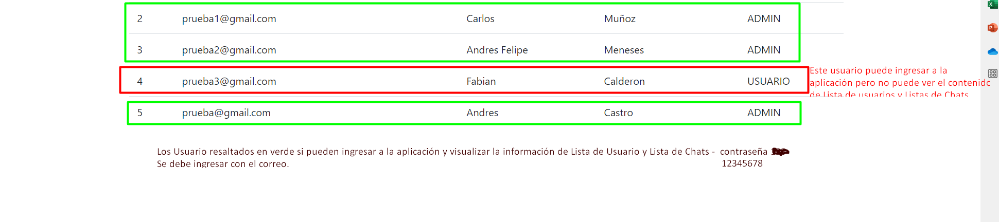
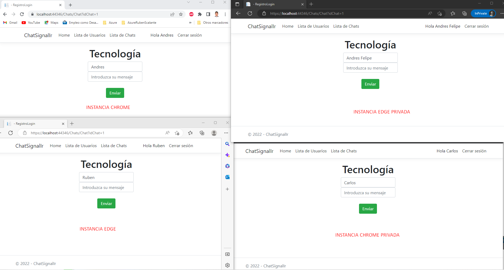

#Chat SignalR.
---
Proyecto [ASP.NET CORE Web APP (MVC)](https://learn.microsoft.com/en-us/aspnet/core/tutorials/first-mvc-app/start-mvc?view=aspnetcore-6.0&tabs=visual-studio), que contiene las funcionalidades de inicio de sesión, registrar usuarios (Usuario - Admin), protección de los endpoints por medio de (sesión cookies, políticas por roles) listado de usuarios, listado de salas de chat desde la Base de datos y envio de mensajes simultáneos (Chat).

####Glosario
* **.NET** - *En general, .NET es el término genérico para .NET Standard, y todas las cargas de trabajo e implementaciones de .NET.
En concreto, .NET hace referencia a la implementación de .NET que se recomienda para todo el desarrollo nuevo: .NET 5 (y .NET Core), así como versiones posteriores.*

* **ASP.NET Core** - *Implementación multiplataforma, de alto rendimiento y de código abierto de ASP.NET. Vea la [documentación de ASP.NET Core.](https://learn.microsoft.com/es-es/aspnet/core/?view=aspnetcore-7.0)*

* **ASP.NET Core MVC** - *ASP.NET Core MVC es un completo marco de trabajo para compilar aplicaciones web y API mediante el patrón de diseño Modelo-Vista-Controlador.*

* **Patrón MVC** - *El patrón de arquitectura del controlador de vista de modelos (MVC) separa una aplicación en tres grupos de componentes principales: modelos, vistas y controladores. Este patrón permite lograr la separación de intereses.*

####¿Qué es SignalR?
Fuente: [¿Qué es SignalR?](https://learn.microsoft.com/es-es/aspnet/signalr/overview/getting-started/introduction-to-signalr)

ASP.NET SignalR es una biblioteca para ASP.NET desarrolladores que simplifican el proceso de agregar funcionalidad web en tiempo real a las aplicaciones. La funcionalidad web en tiempo real es la capacidad de que el código del servidor inserte contenido en los clientes conectados al instante a medida que esté disponible, en lugar de tener que esperar al servidor a que un cliente solicite nuevos datos.

####Construido con  🛠️
#####1. IDE
* [Visual Studio Profesional](https://visualstudio.microsoft.com/es/vs/professional/) - Entorno de desarrollo integrado para cualquier aplicación, cualquier lenguaje, cualquier plataforma. Para el desarrollo del ChatSignalR se utilizó la versión 2022. [Enlace de Descarga](https://visualstudio.microsoft.com/es/thank-you-downloading-visual-studio/?sku=Professional&rel=16) 

#####2. SDK y entornos de ejecución
* [.NET](https://docs.microsoft.com/es-es/dotnet/fundamentals/) - Core gratuito y de código abierto para los sistemas operativos Windows, Linux y macOS. ​ Es un sucesor multiplataforma de .NET Framework. Se utilizó la versión  6.0. [Enlace de Descarga](https://dotnet.microsoft.com/en-us/download)

#####3. Lenguaje de programación
* [C#](https://docs.microsoft.com/es-es/dotnet/csharp/) - Lenguaje de programación moderno, basado en objetos y con seguridad de tipos. La descarga se realiza mediante el Installer del visual studio.

#####4. Otros
* HTML5
* JavaScript
* CSS
* Bootstrap

####Funcionamiento 📐
* Usuarios creados en la BD

* Instancias de los navegadores Chrome, Edge

* Ejecución Éxitosa del chat con SignalR

####Utilidades 💪
* La base de datos para gestionar los usuarios, relacionar los nombres de las salas del chat se alojó en [Somee]( https://somee.com/) plan gratuito.
Las credenciales para ingresar a la base de datos se encuentra en el appsettings.json.

####Autor ✒️
* **Ruben Dario Scalante Rojas**
